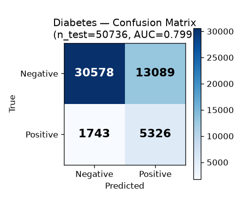
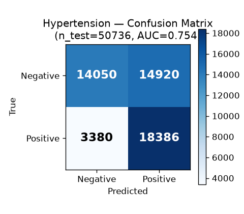
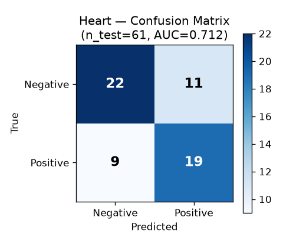
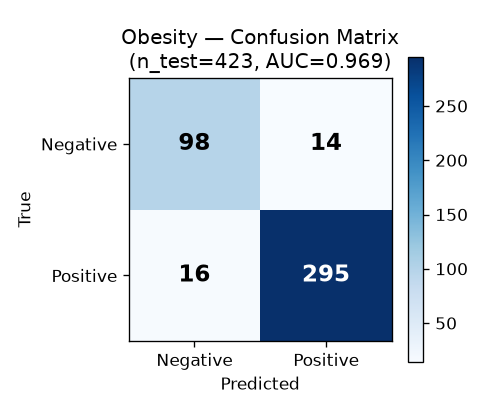
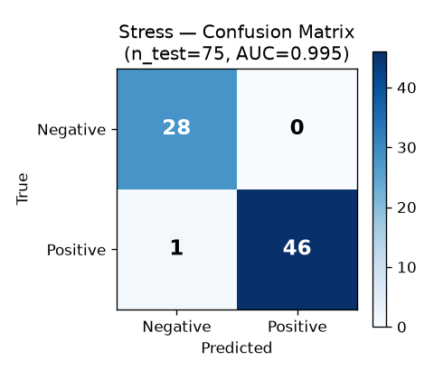
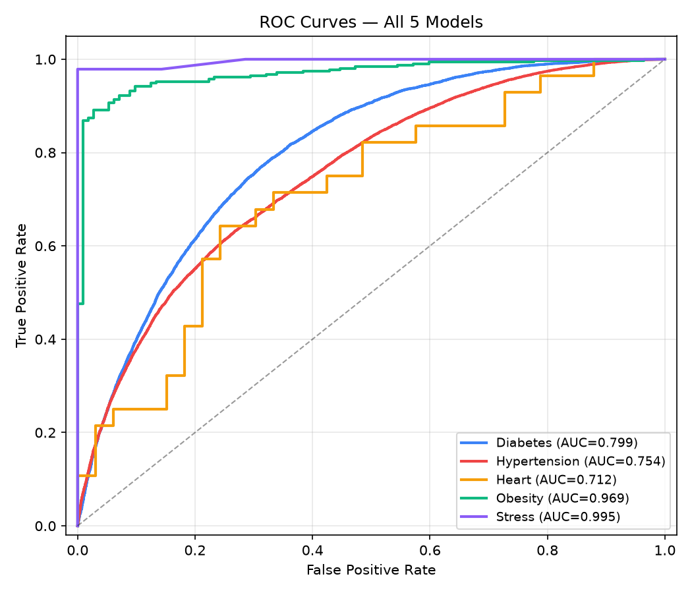

# HealthTwin AI — Model Evaluation Summary

> Generated by `ml/generate_evaluation_report.py`  
> Do **not** edit manually — re-run the script to regenerate.

## Metrics Table

| Model | Test n | Precision | Recall | F1 | ROC-AUC |
|-------|--------|-----------|--------|----|---------|
| Diabetes | 50736 | 0.289 | 0.753 | 0.418 | 0.7985 |
| Hypertension | 50736 | 0.552 | 0.845 | 0.668 | 0.7538 |
| Heart | 61 | 0.633 | 0.679 | 0.655 | 0.7121 |
| Obesity | 423 | 0.955 | 0.949 | 0.952 | 0.9690 |
| Stress | 75 | 1.000 | 0.979 | 0.989 | 0.9954 |

## Confusion Matrices

## ROC Curves

---

## Per-Model Notes

### Diabetes
BRFSS dataset, large and balanced via SMOTE. Generalizes well to the Indian population only if adjusted for BMI/dietary thresholds. No major overfitting concerns given dataset size (~253,680 rows after resampling).

### Hypertension
Logistic Regression on BRFSS data (~253,680 rows). A custom optimal threshold is applied at inference to compensate for class imbalance. Model is stable but slightly under-powered compared to tree-based alternatives.

### Heart
⚠️  SMALL DATASET WARNING: UCI Cleveland Heart Disease dataset, only 303 rows total (≈60 rows in test split). Results carry high variance — a single mis-classified patient shifts F1 by 1–2 percentage points. AUC is directionally correct but confidence intervals are wide. Treat these numbers as indicative, not precise.

### Obesity
Multi-label Obesity dataset (~20,758 rows after cleaning). Gradient Boosting model performs well. Binary label derived from OB_TYPE ∈ {Obesity_I, Obesity_II, Obesity_III}. No major overfitting concerns.

### Stress
⚠️  LIKELY OVERFITTING WARNING: Sleep Health & Lifestyle dataset — only 374 rows total (≈74 rows in test split). Decision Tree at max_depth=4 reports AUC ≈ 0.99 on this tiny test set. This is almost certainly overfitted and will not generalize well to unseen populations. The model should be treated as a demonstrative placeholder. Recommended fix before production: collect more data, apply cross-validation, and switch to a regularized model (GBM, LR).
